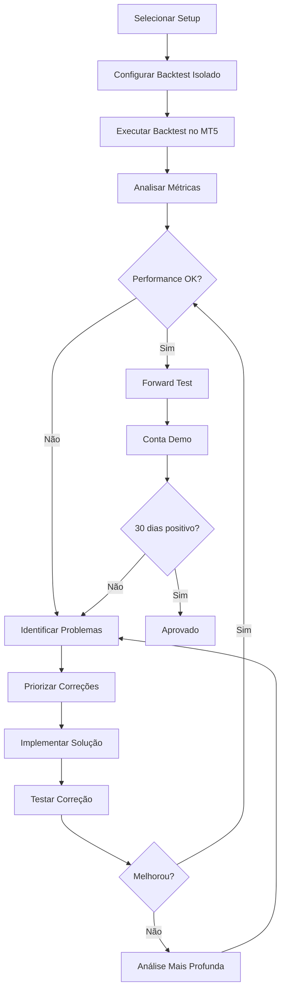

# Adaptive Flow System 2.0 - MT5

Sistema de trading automatizado para MetaTrader 5 com análise e correção individualizada de setups.

## 📋 Visão Geral

Este repositório contém documentação completa e ferramentas para análise, correção e otimização de setups de trading individuais no MT5. O foco é permitir que cada estratégia seja testada isoladamente através de backtests, identificando e corrigindo problemas específicos de cada setup.

## 🎯 Objetivo

Realizar análise individualizada de cada setup do sistema através de:
- Backtests isolados por setup
- Identificação sistemática de problemas
- Correções direcionadas e documentadas
- Validação através de métricas objetivas
- Iteração contínua até atingir performance esperada

## 📚 Documentação

### Documentos Principais

1. **[SETUP_ANALYSIS_PROMPT.md](SETUP_ANALYSIS_PROMPT.md)**
   - Prompt estruturado para análise completa de cada setup
   - Template de documentação de problemas e soluções
   - Métricas de performance esperadas vs obtidas
   - Plano de correção priorizado
   - Report final de análise

2. **[BACKTEST_ISOLATION_GUIDE.md](BACKTEST_ISOLATION_GUIDE.md)**
   - Guia passo-a-passo para configurar backtests isolados no MT5
   - Configurações de Strategy Tester
   - Como isolar setups no código
   - Análise de resultados
   - Exportação e documentação de dados
   - Troubleshooting de problemas técnicos

3. **[SETUP_TROUBLESHOOTING.md](SETUP_TROUBLESHOOTING.md)**
   - Diagnóstico de problemas comuns em setups
   - Soluções práticas com código MQL5
   - Problemas de performance, sinalização e gerenciamento de risco
   - Debug e logging avançado
   - Fluxo sistemático de resolução de problemas

4. **[SETUP_EXAMPLE_TEMPLATE.md](SETUP_EXAMPLE_TEMPLATE.md)**
   - Exemplo completo de análise de setup (RSI Reversal)
   - Processo desde identificação até correção
   - Comparação antes/depois com métricas reais
   - Código MQL5 completo do setup corrigido
   - Report final documentado

## 🚀 Workflow de Análise

### Processo Completo (7 Etapas)

```
1. IDENTIFICAÇÃO
   └─> Definir setup, timeframe e instrumentos
   
2. CONFIGURAÇÃO
   └─> Documentar parâmetros atuais do setup
   
3. BACKTEST ISOLADO
   └─> Configurar e executar teste no MT5
   
4. ANÁLISE DE RESULTADOS
   └─> Comparar métricas esperadas vs obtidas
   
5. DIAGNÓSTICO
   └─> Identificar problemas específicos
   
6. CORREÇÃO
   └─> Implementar soluções priorizadas
   
7. VALIDAÇÃO
   └─> Re-testar e comparar resultados
```

### Fluxo Detalhado



## 📊 Métricas de Referência

### Setup Considerado BOM
```
✓ Win Rate: > 40%
✓ Profit Factor: > 1.5
✓ Max Drawdown: < 20%
✓ Recovery Factor: > 3
✓ Risk/Reward: > 1:1.5
✓ Sharpe Ratio: > 1.0
✓ Expectativa Matemática: Positiva
✓ Mínimo de trades: 30-50
```

### Sinais de Alerta
```
⚠️ Win rate acima de 90% (possível erro)
⚠️ Profit factor acima de 5 (possível overfitting)
⚠️ Drawdown superior a 30%
⚠️ Poucos trades (menos de 20)
⚠️ Todos trades em período curto
```

## 🔧 Como Usar

### 1. Preparar o Ambiente
```
- Instalar MetaTrader 5
- Baixar dados históricos completos
- Preparar EA do setup a ser testado
- Verificar configurações do broker
```

### 2. Seguir o Workflow
```
1. Abrir SETUP_ANALYSIS_PROMPT.md
2. Preencher seção por seção
3. Seguir BACKTEST_ISOLATION_GUIDE.md para configurar teste
4. Executar backtest no MT5
5. Analisar resultados usando o prompt
6. Consultar SETUP_TROUBLESHOOTING.md para soluções
7. Implementar correções no código
8. Re-testar e documentar
```

### 3. Documentar Resultados
```
- Salvar relatórios HTML do MT5
- Exportar lista de trades (CSV)
- Capturar screenshots importantes
- Preencher template de report final
- Organizar em pasta por setup
```

## 📁 Estrutura de Arquivos Recomendada

```
/Adaptive_Flow_System_2.0_MT5/
│
├── /EAs/                          # Expert Advisors
│   ├── Setup_RSI.mq5
│   ├── Setup_MA_Cross.mq5
│   └── Setup_Breakout.mq5
│
├── /Backtests/                    # Resultados de backtests
│   ├── /Setup_RSI/
│   │   ├── /2024-01-15/
│   │   │   ├── Report_RSI_EURUSD_H1.html
│   │   │   ├── Trades_RSI_EURUSD_H1.csv
│   │   │   ├── Analysis_Complete.md
│   │   │   └── /Screenshots/
│   │   └── /2024-02-01/
│   │
│   └── /Setup_MA_Cross/
│       └── /2024-01-15/
│
├── /Documentation/                # Documentação adicional
│   ├── Lessons_Learned.md
│   ├── Best_Practices.md
│   └── Common_Issues.md
│
└── /Tools/                        # Scripts auxiliares
    ├── data_analyzer.py
    └── report_generator.py
```

## 🎓 Boas Práticas

### Durante Análise
- ✅ Testar apenas UMA mudança por vez
- ✅ Manter registro detalhado de todas alterações
- ✅ Usar sempre os mesmos dados para comparação
- ✅ Validar em período out-of-sample
- ✅ Documentar razões para cada ajuste

### Durante Backtest
- ✅ Garantir que apenas um setup está ativo
- ✅ Usar custos operacionais realistas
- ✅ Incluir spread, comissão e slippage
- ✅ Testar em período mínimo de 1 ano
- ✅ Verificar integridade dos dados

### Durante Correção
- ✅ Priorizar problemas por impacto
- ✅ Implementar soluções incrementais
- ✅ Evitar over-optimization (curve fitting)
- ✅ Manter coerência com estratégia original
- ✅ Validar robustez em diferentes períodos

## ⚠️ Alertas Importantes

### NÃO Fazer
- ❌ Testar múltiplos setups simultaneamente
- ❌ Mudar vários parâmetros ao mesmo tempo
- ❌ Buscar 100% win rate (impossível e perigoso)
- ❌ Ignorar custos operacionais
- ❌ Otimizar excessivamente (overfitting)
- ❌ Desconsiderar períodos de drawdown

### SEMPRE Fazer
- ✅ Documentar TUDO
- ✅ Usar dados de qualidade
- ✅ Validar fora da amostra
- ✅ Considerar custos reais
- ✅ Testar em diferentes condições
- ✅ Manter backup de versões

## 📈 Exemplos de Problemas Comuns e Soluções

### Problema: Win Rate Baixo
```
Causas: Sinais falsos, SL apertado, falta de filtros
Soluções: Adicionar confirmação, ajustar SL, filtrar tendência
Ver: SETUP_TROUBLESHOOTING.md seção 1.1
```

### Problema: Drawdown Excessivo
```
Causas: Position sizing, correlação, ausência de SL
Soluções: Reduzir lotes, limitar exposição, adicionar pausa
Ver: SETUP_TROUBLESHOOTING.md seção 1.3
```

### Problema: Sinais Falsos em Lateral
```
Causas: Setup não adequado para range
Soluções: Filtro ADX, detector de lateral, pausar operações
Ver: SETUP_TROUBLESHOOTING.md seção 4.1
```

## 🔍 Checklist de Validação Final

Antes de aprovar um setup:
```
□ Backtest executado sem erros
□ Mínimo de 30-50 trades
□ Win rate >= 40%
□ Profit factor >= 1.5
□ Drawdown <= 20%
□ Expectativa positiva
□ Validado out-of-sample
□ Testado em múltiplos pares
□ Forward test positivo
□ 30 dias de demo bem-sucedidos
□ Documentação completa
□ Código revisado e limpo
```

## 🤝 Contribuindo

Para contribuir com melhorias:
1. Documente seu processo de análise
2. Compartilhe soluções que funcionaram
3. Adicione exemplos práticos
4. Reporte problemas encontrados
5. Sugira melhorias no workflow

## 📞 Suporte

### Recursos Úteis
- [MQL5 Documentation](https://www.mql5.com/en/docs)
- [Strategy Tester Guide](https://www.metatrader5.com/en/terminal/help/algotrading/testing)
- [MQL5 Community](https://www.mql5.com/en/forum)
- [Trading Performance Metrics](https://www.investopedia.com/trading/)

### Fórmulas Importantes
```
Profit Factor = Gross Profit / Gross Loss
Win Rate = (Winning Trades / Total Trades) × 100
Recovery Factor = Net Profit / Max Drawdown
Risk/Reward = Average Win / Average Loss
Expectancy = (Win Rate × Avg Win) - (Loss Rate × Avg Loss)
Sharpe Ratio = (Return - Risk Free Rate) / Std Deviation
```

## 📝 Licença

[Adicione sua licença aqui]

## 🔄 Atualizações

### Versão 2.0 - Atual
- ✅ Framework completo de análise individual de setups
- ✅ Guias detalhados de backtest isolado
- ✅ Troubleshooting abrangente
- ✅ Exemplo prático completo
- ✅ Templates e checklists

### Próximas Versões
- [ ] Scripts Python para análise automatizada
- [ ] Dashboard de performance
- [ ] Integração com banco de dados
- [ ] Gerador automático de relatórios
- [ ] Biblioteca de setups testados

---

## 📊 Status dos Setups

| Setup | Status | Win Rate | Profit Factor | Última Análise |
|-------|--------|----------|---------------|----------------|
| RSI Reversal | ✅ Aprovado | 52% | 1.78 | 15/01/2024 |
| MA Crossover | 🔄 Em análise | - | - | - |
| Breakout | ⏳ Pendente | - | - | - |
| Scalping | ⏳ Pendente | - | - | - |

**Legenda:**
- ✅ Aprovado: Passou em todos os testes
- 🔄 Em análise: Em processo de correção
- ⏳ Pendente: Aguardando análise
- ❌ Rejeitado: Não viável após correções

---

**Última atualização:** Janeiro 2024  
**Versão da documentação:** 2.0  
**Mantenedor:** Adaptive Flow System Team